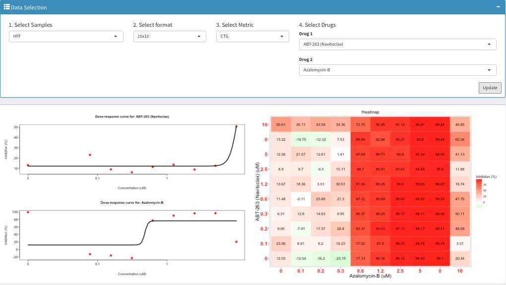

## Combination Drug Screen Shiny Module
This shiny app allows users to explore and visualize a set of combination drug sreen data. It is currently mirroring 
the input and output of R package (synergyfinder)[https://github.com/cran/synergyfinder].



## How to test the example

In your command line prompt/terminal, clone this repo
```
git clone https://github.com/Sage-Bionetworks/shinyModules.git
```
Go to the example directory
```
cd shinyModules/combinationDrugScreen/example2/
```
Run the shiny app
```
R -e "shiny::runApp()"
```

## Input Requirements:

To be completed.


