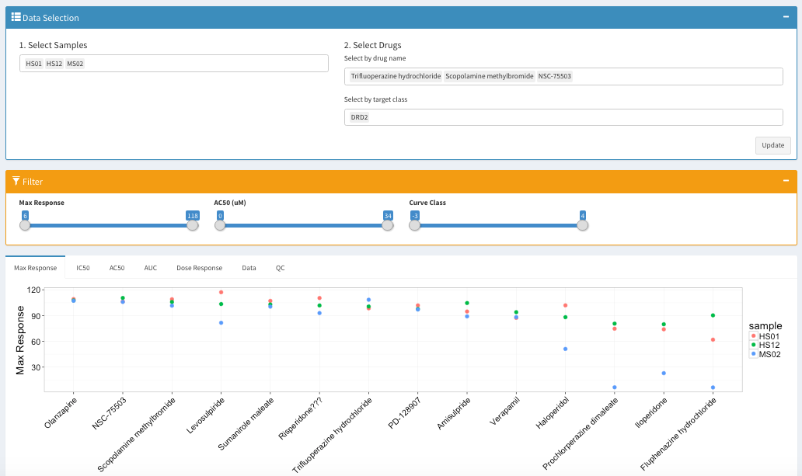
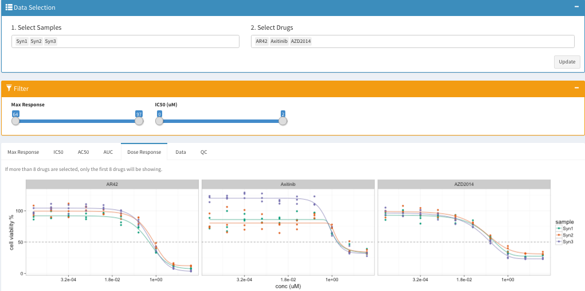
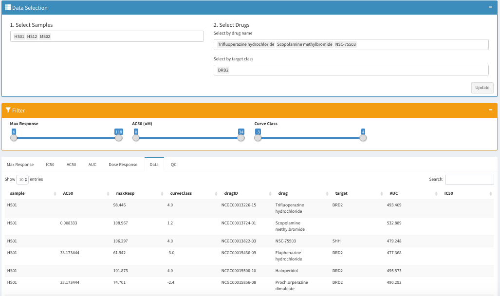
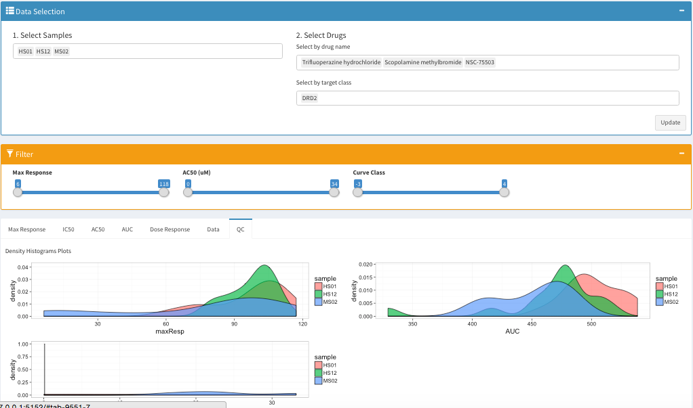

## Shiny Module Drug Screen
This shiny app allows users to explore and visualize a drug screen dataset. It has 3 components: a data selecting tab, a filter tab, and a plot-display window. 

In the display window, there are 7 tabs: Max Response, IC50, AC50, AUC, Dose Response, Data, and QC.

#### Max Response:


#### Dose Reseponse:


#### Data:


#### QC:


## How to test the example

In your command line prompt/terminal, clone this repo
```
git clone https://github.com/Sage-Bionetworks/shinyModules.git
```
Go to the example directory
```
cd shinyModules/drugScreen/example1/
```
Run the shiny app
```
R -e "shiny::runApp()"
```

## Input Requirements:

1. Columns

  * Raw Data

    | column name | description | optional/required? |
    |---|---|---|
    | sample | name of the cell line | **required** |
    | replicate | replicate of the sample | optional |
    | conc | concentrantion of the drug | **required**|
    | drug |  name of the drug | **required** |
    | normViability |  normalized viability | **required** |

  * Processed Data

    | column name | description | optional/required? |
    |---|---|---|
    | sample | name of the cell line | **required** |
    | AC50 | value of AC50 in micromolar(uM) | optional |
    | IC50 | value of IC50 in micromolar(uM) | optional |
    | maxResp | value of maximum response in scale 1-100 | **required** |
    | curveClass | defined curve class | optional |
    | drugID | drug ID | optional |
    | drug | name of the drug| **required** |
    | target | target class of the drug | optional |
    | AUC | area under the curve using the Simpson’s rule or the trapezoid method| optional |

2. Unit/Scale

  * Raw Data
    
      **conc**: molar(M)

  * Processed Data

      **AC50** and **IC50** : micromolar (uM) 

      **maxResp** : scale of 1 - 100


