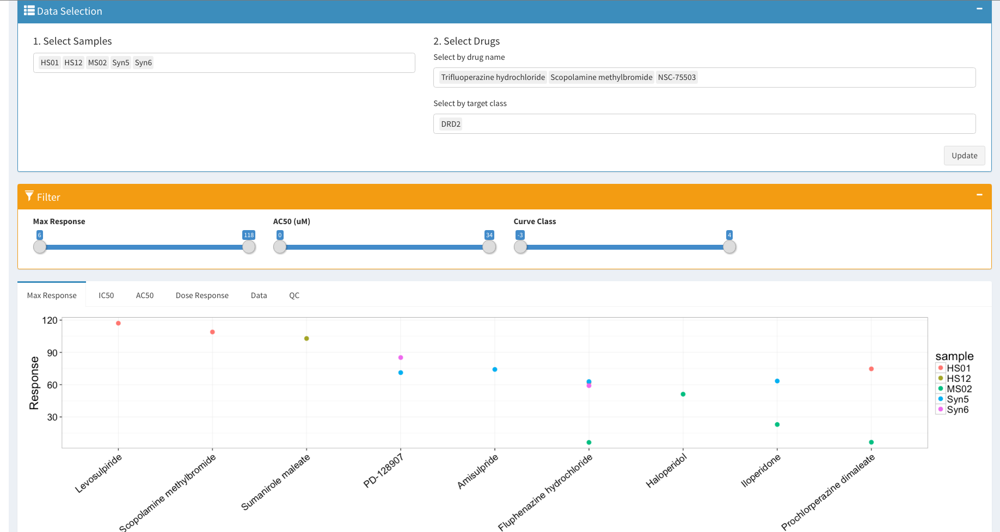

## Shiny Module Drug Screen
###Input: raw data and/or processed data

####Requirements:

1. Columns

  * Raw Data

    | column name | description | optional/required? |
    |---|---|---|
    | sample |   |   |
    | replicate |   |   |
    | conc |   |   |
    | drug |   |   |
    | normViability |    |   |

  * Processed Data

2. Units

  * Raw Data

  *  Processed Data

### Output: A data-exploring shiny app
	

#### Example 1 - Using proccessed data

