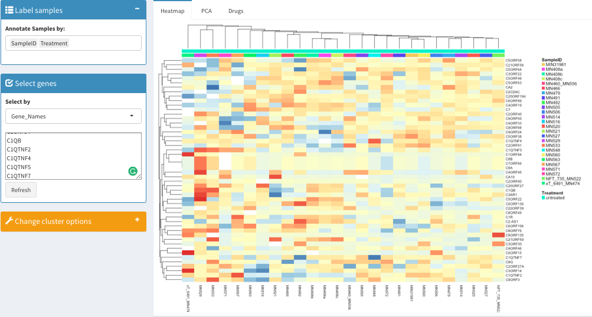
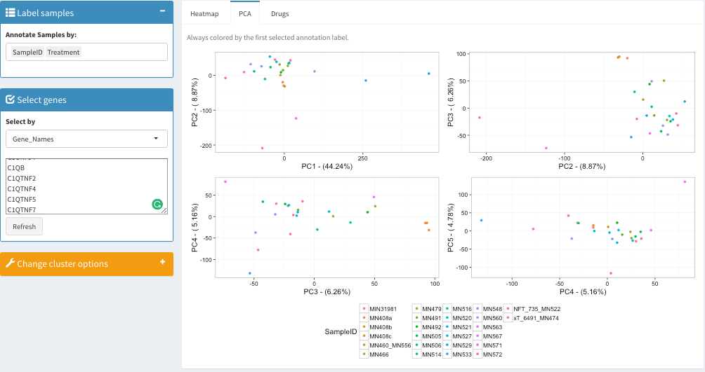

## Expression Viewer Shiny Module
This shiny app allows users to explore and visualize an expression data set. 

#### Heatmap:


#### PCA:


## How to test the example

In your command line prompt/terminal, clone this repo
```
git clone https://github.com/Sage-Bionetworks/shinyModules.git
```
Go to the example directory
```
cd shinyModules/expressionViewer/example2/
```
Run the shiny app
```
R -e "shiny::runApp()"
```

## Input Requirements:
- An ExpressionSet object ([What is ExpressionSet?](https://www.bioconductor.org/packages/devel/bioc/vignettes/Biobase/inst/doc/ExpressionSetIntroduction.pdf))
- A list of pathways


